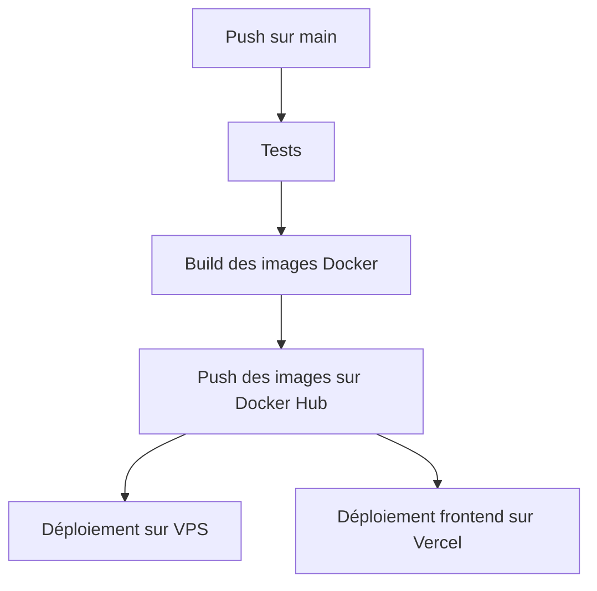

# Guide de déploiement - FocusLightCommerce

Ce guide présente les différentes options de déploiement pour l'application FocusLightCommerce.

## 🔍 Vue d'ensemble

L'application propose plusieurs stratégies de déploiement selon vos besoins :

1. **Architecture hybride** : Frontend sur Vercel + Backend & BDD sur VPS (Docker)
2. **Architecture complète Docker** : Tous les services dans des conteneurs Docker sur VPS
3. **Développement local** : Options avec ou sans Docker

## 📋 Prérequis

- Docker et Docker Compose (pour les options utilisant Docker)
- Node.js v16+ et npm (pour le développement sans Docker)
- Un compte Vercel (pour l'option hybride)
- Un VPS avec accès SSH et Docker installé
- Un nom de domaine (optionnel mais recommandé)

## 🚀 Options de déploiement

### Option 1 : Architecture hybride (recommandée)

Cette approche tire parti des avantages de Vercel pour le frontend (CDN, déploiements automatiques) et de Docker pour le backend et la base de données (contrôle, persistance).

#### 1. Déploiement du frontend sur Vercel

1. Connectez votre dépôt GitHub à Vercel
2. Configurez les variables d'environnement dans Vercel :
   - `API_URL`: URL de votre API backend (ex: https://api.votredomaine.com)
   - `NODE_ENV`: "production"
3. Vercel utilisera automatiquement le script `vercel-build` défini dans package.json

#### 2. Déploiement du backend et BDD sur VPS

1. Clonez le dépôt sur votre VPS :

   ```bash
   git clone https://github.com/VotreUsername/FocusLightCommerce.git
   cd FocusLightCommerce
   ```

2. Créez un fichier `.env` basé sur `.env.example` :

   ```bash
   cp .env.example .env
   # Modifiez le fichier .env avec vos valeurs
   ```

3. Déployez les services backend :

   ```bash
   make deploy-backend
   ```

4. Configurez un serveur web (Nginx/Caddy) comme proxy inverse :

   ```nginx
   # Exemple Nginx
   server {
       listen 80;
       server_name api.votredomaine.com;

       location / {
           proxy_pass http://localhost:5000;
           proxy_set_header Host $host;
           proxy_set_header X-Real-IP $remote_addr;
       }
   }
   ```

5. Configurez SSL avec Certbot :
   ```bash
   certbot --nginx -d api.votredomaine.com
   ```

### Option 2 : Architecture complète Docker

Tout déployer via Docker sur un seul VPS :

1. Clonez le dépôt sur votre VPS
2. Configurez le fichier `.env`
3. Lancez le déploiement complet :

   ```bash
   make prod
   ```

4. Configurez un serveur web comme proxy inverse pointant vers les différents services

## 🔄 Intégration continue et déploiement continu (CI/CD)

Le projet est configuré pour utiliser GitHub Actions pour l'automatisation du déploiement.

### Configuration GitHub Actions

1. Ajoutez les secrets GitHub nécessaires :

   - `DOCKERHUB_USERNAME`: Votre nom d'utilisateur Docker Hub
   - `DOCKERHUB_TOKEN`: Votre token d'accès Docker Hub
   - `VPS_HOST`: L'adresse IP de votre VPS
   - `VPS_USERNAME`: Utilisateur SSH sur le VPS
   - `VPS_SSH_KEY`: Votre clé SSH privée
   - `VPS_SSH_PASSPHRASE`: La phrase de passe de votre clé SSH (si applicable)
   - `FRONTEND_URL`: URL de votre frontend sur Vercel (ex: https://votresite.vercel.app)

   **Configuration des secrets GitHub** :

   Pour ajouter ces secrets à votre dépôt GitHub :

   1. Accédez à votre dépôt sur GitHub
   2. Allez dans "Settings" > "Secrets and variables" > "Actions"
   3. Cliquez sur "New repository secret"
   4. Ajoutez chaque secret un par un avec son nom et sa valeur

   **Configuration de la base de données** :  
   Pour les variables liées à la base de données, vous pouvez les définir vous-même :

   - `DB_USER`: Choisissez un nom d'utilisateur pour votre base de données (ex: "focuslight")
   - `DB_PASSWORD`: Définissez un mot de passe fort et unique
   - `DB_NAME`: Nom de la base de données (généralement "focuslight")
   - `DB_CONNECTION_STRING`: Utilisez le format suivant : `postgresql://${DB_USER}:${DB_PASSWORD}@db:5432/${DB_NAME}`
     - Note: Si vous utilisez une BDD externe, remplacez "db:5432" par l'adresse de votre serveur PostgreSQL

   > La première fois que les conteneurs Docker démarrent, la base de données sera automatiquement créée avec les paramètres spécifiés.

   - `SESSION_SECRET`: Génère une chaîne aléatoire pour sécuriser les sessions (ex: `openssl rand -hex 32`)
   - `API_URL`: URL de l'API backend
   - `FRONTEND_PORT`: Port pour le frontend (architecture complète Docker)
   - `BACKEND_PORT`: Port pour le backend

2. Le workflow déploiera automatiquement lors des push sur la branche main

### Workflow de déploiement



## 🔍 Base de données

### Gestion des migrations et données

La base de données utilise Drizzle ORM pour les migrations :

```bash
# Appliquer les migrations
npm run db:push

# Créer une sauvegarde de la base de données
make dump-prod

# Restaurer une sauvegarde
make restore-prod file=./db/dumps/backup.sql
```

### Persistance des données

Les données PostgreSQL sont stockées dans un volume Docker nommé `postgres-data` qui persiste entre les redémarrages des conteneurs.

## 🚨 Dépannage

### Problèmes courants

1. **Erreur CORS**: Vérifiez que `FRONTEND_URL` est correctement configuré dans le backend
2. **Erreur de connexion à la base de données**: Vérifiez le `DB_CONNECTION_STRING` et que le conteneur DB est en cours d'exécution
3. **Erreur de session**: Assurez-vous que `SESSION_SECRET` est défini

### Logs et monitoring

```bash
# Voir les logs des conteneurs Docker
docker logs focuslight-backend
docker logs focuslight-db

# Surveiller les conteneurs en cours d'exécution
docker ps
```

## 📅 Prochaines étapes recommandées

1. **Configuration de la base de données de production**

   - Créer une instance PostgreSQL gérée (chez un fournisseur cloud) ou via Docker
   - Configurez les sauvegardes automatiques

2. **Mise en place de monitoring**

   - Ajoutez des services de surveillance (Prometheus, Grafana, ou services managés)

3. **Considérations de sécurité**
   - Ajoutez un pare-feu et limitez l'accès aux services
   - Mettez en place des scans de vulnérabilités
